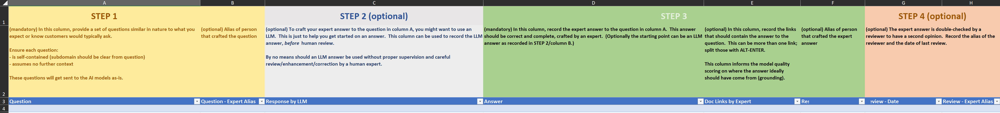

# **Producing Golden Datasets**

Guidance for creating Golden Datasets used for Copilot quality assurance

## **The Need for Golden Datasets**

When designing and developing Copilot experiences, you’ll want to make sure that the design and implementation decisions you take contribute to a better customer experience. Such decisions, such as the choice of Large Language Model (LLM), its parameters, construction of the prompt or retrieval of context for the prompt) influence to a great extent the usefulness, adoptability and quality of your end product; as such it’s important to back those up with a methodology, starting from the desired end-customer experience. This guide describes how such methodology can leverage a so-called “golden dataset” to guide and improve decision-making.

As you create the Copilot experience that use those LLMs, you typically rely on source datasets (typically internal datasets, documents, websites, …) to ground the model in your own data for context and make sure they don’t hallucinate. Even then, you still want to ensure that the LLMs produce the most accurate and helpful response possible for the question the customer asked. This is even more important considering, you might want to evaluate more than one LLM with different parameter values and multiple ways to prompt each of those; all decisions which all influence the response that is ultimately presented to the customer.

## **What is a Golden Dataset?**

A "Golden Dataset" is a collection of **realistic customer questions** along with **expert answers** that is used to provide Quality Assurance for your Copilot experiences powered by LLMs.

*Golden Datasets are not used as source data* to train or fine-tune an LLM or inject context into an LLM prompt; they are used to *assess the quality of the answers that come back from the LLM*. This is done by sending each question in the golden dataset to one or more LLMs and comparing the AI-generated Copilot answers with the expert answer. If they are similar, the quality of the LLM is high, otherwise the LLM or any of its parameters might need to be tweaked or removed from the LLMs being evaluated. This might mean changing the LLM itself, or more realistically, looking for opportunities to change the way its prompt is being generated or how the relevant context is retrieved from the data source for constructing the prompt.

A Golden Dataset allows you to gain insights into how well your LLM is responding to customer questions and this can be compared to how unit tests in your code make sure it behaves as expected, you can be notified when behavior deviates or fails.

The Golden Dataset isn't only useful when a Copilot experience is initially created and validated: as their source grounding data, the version of the LLM, or the way the LLM prompt is constructed change, the quality of the generated answers can be continuously compared against the expert answer. When there is significant or continued drift, this might also be an indication that the Golden Dataset is no longer up to date with reality and should be revised.

## **Suggested process**

A Golden Dataset should contain **a set of realistic question/answer pairs**. For statistical relevance, you should typically aim to have about 150 question/answer pairs (but certainly not less than 100). At a minimum, only the question-and-answer text are strictly needed. The questions should cover the major areas in the domains that you expect customers to ask questions about.

**Step 1: Create questions**
  -   Create a set of questions related to your product, service or domain that customers would typically ask.
  -   While it’s tempting to think about the kinds of information readily available in your grounding data, you should avoid thinking about *answers* first, rather think about the most *realistic questions you'd get from your non-expert customers, independently of the available grounding data*. In this way, as much as possible, you’ll emulate the experience of a real end-user.
  -   These questions will typically get sent to the LLM as-is, so you should ensure the question is self-contained and assumes no other context. (For example: if your Copilot covers both questions on “corporate compliance” and on the “employee handbook”, make sure it’s clear within every question itself what that question is about as any ambiguity would detract from a proper evaluation.)

**Step 2 (optional): Generate LLM response(s)**
  -   This step is optional but helps to (1) reduce manual effort and (2) gain an understanding of the base level performance of the LLM.
  -   For each question, generate a response from the LLM (either the Copilot default LLM if possible or a more generic LLM like Bing Chat Enterprise or ChatGPT).
  -   This answer will serve as a *starting point* for an expert to properly answer the question in the next step. By no means should this LLM answer be used without proper supervision and careful review/enhancement/correction by a human expert.

**Step 3: Create expert responses**
  -   For each question, have a domain expert craft a response that is both correct and complete.
  -   If you have an LLM generated response from the previous step, use that as a starting point for your expert response. The value of your Golden Dataset relies entirely on the answers being both accurate and complete, so make sure to review, enhance, correct any answers – especially those generated by an LLM to start with.
  -   [Optional] Along with the expert response, you should also include any references to the source documents. The goal here is to compare the LLM citations (which come from internal data sources) to the source references you provided in the Golden Dataset to assess the quality of the LLM responses and help with longer-term governance.

**Step 4 (optional): Review answers and expert responses**
  -   To ensure the questions and responses are correct and complete, it might help to have an additional QA pass through the golden dataset by a second domain expert.
  -   Once all questions are answered and reviewed, the work is complete.

Once the dataset is prepared, it is ready to be used in the calculation of quality metrics for your Copilot experience. (See “evaluation process”)

## **Structure of the Golden Dataset**

You may choose to collect and curate your Golden Dataset using any tool of your choice that is able to export the data to CSV or jsonl. This includes, for example Excel, Microsoft Lists or a CSV file directly.

Taking into account the above suggested process, you’ll end up with a structure similar to the following:

From the above example Excel template, the required CSV (with “Question” and “Answer” columns at a minimum) can be exported.

## **Guidance on questions & answers**

-   Producing quality questions and responses, depending on the domain complexity, can take a non-trivial amount of time, like for example, answering a customer email which takes time to ensure it’s both correct and complete.
-   As mentioned above, make sure the question stands by itself and has enough context to answer it.
-   Typical questions start with:
-   Are there...?
-   Can you give me...?
-   How can I...?
-   How do I know...?
-   How do I...?
-   How does...?
-   How often...?
-   How should I...?
-   Is it possible...?
-   Should I...?
-   Tell me about...
-   What about...?
-   What are...?
-   What is...?
-   What's the best way...?
-   Why should I...?
-   What are the recommended best practices for ...?

## **Evaluation process**

Once the golden dataset is ready, the next step is to use it to measure the quality of LLM responses for your Copilot. Here Prompt flow can be used to measure all the relevant metrics: GPT similarity; Relevance; Coherence and Grounded-ness.

After each evaluation, metrics like the following will be available to quantify the user experience. For example:

| Similarity  | Relevance  | Coherence  | Grounded-ness  |
|-------------|------------|------------|----------------|
| 3.7         | 77         | 88         | 69             |

What follows is a description and the suggested goals for these metrics (please see the [online documentation](https://learn.microsoft.com/azure/machine-learning/prompt-flow/how-to-bulk-test-evaluate-flow?view=azureml-api-2#understand-the-built-in-evaluation-metrics) for more information):

| Name                                     | Description                                                                                                                                                                                                                                                                                                                                                                                                    |
|------------------------------------------|----------------------------------------------------------------------------------------------------------------------------------------------------------------------------------------------------------------------------------------------------------------------------------------------------------------------------------------------------------------------------------------------------------------|
| QnA GPT Similarity Evaluation            | Measures how similar the responses from LLM are to the human expert.  Similarity is scored on a scale of 1 to 5, with 1 being the worst and 5 being the best.    Suggested Goal: 3+.                                                                                                                                                                                                                           |
| QnA Relevance Scores Pairwise Evaluation | Measure of how relevant the response is to the context provided.  0-20: the answer completely lacks confidence.  20-40: the answer mostly lacks confidence  40-60: the answer is partially confidence  60-80: the answer is mostly confidence  80-100: the answer has perfect confidence    Coherence is scored on a scale of 0 to 100, with 1 being the worst and 100 being the best.    Suggested Goal: 60+  |
| QnA Coherence Evaluation                 | Measures the quality of all sentences in a model's predicted answer and how they fit together naturally.  Coherence is scored on a scale of 1 to 5, with 1 being the worst and 5 being the best.    Suggested Goal: 3+                                                                                                                                                                                         |
| QnA Groundedness Evaluation              | Measure of how grounded the model's predicted answers are against the context. Even if LLM’s responses are true, if not verifiable against context, then such responses are considered ungrounded.  Grounded-ness metric is scored on a scale of 1 to 5, with 1 being the worst and 5 being the best.    Suggested Goal: 3+                                                                                    |

## **FAQ**

**How many questions do I need?**

To get statistically relevant numbers with respect to your domain and depending on your domain, a minimum dataset of 100 question-answer pairs is required. We do recommend aiming for 150 for larger domains.

**Is it ok to use an LLM to create my questions?**

While synthetic question generation can be a strong and useful tool in certain situations, we recommend **against** this when trying to measure a quality metric that reflects a real-world customer-experience. Questions should, to the maximum extent possible, reflect what customers would ask in reality. It’s unlikely that it would align naturally with the questions an LLM would come up with. Instead, it’s best to hand-craft your questions with your customer in mind.

**Is it ok to use an LLM for creation of the expert answer?**

An LLM can be used to improve your productivity and give you a head-start in crafting your expert answer. Especially, to save time when you are curating a large collection of Question/Answer pairs. However, you should never use an LLM answer as-is without proper, deep expert validation, making sure the answer is both correct and complete.
