# Personalized Financial advise using banking customer data on PostgreSQL/CosmosDB

Customer data stored in operational databases will be useful to enrich context for LLM generations. In this post we will generate personalized financial advise to banking customers using their data stored in a database. We will use PromptFlow for LLM app development and postgresql/cosmosdb for storing customer data.

Prompt flow, a new service within Azure ML suite of services, addresses challenges associated with LLM App development. Main benefit is that prompt flow brings together LLM’s, 3rd party API’s, OS models, tools for prompt engineering and to evaluate prompt/model variants.

* [Open-sourced prompt flow](https://github.com/microsoft/promptflow)
* [Prompt flow cloud - Azure Machine Learning](https://learn.microsoft.com/en-us/azure/machine-learning/prompt-flow/overview-what-is-prompt-flow?view=azureml-api-2)

In this tutorial we will use prompt flow open-sourced version, which is the pure local tool, to build a LLM-app that generates personalized financial advise to banking customers. We will use postgresql / cosmosdb for storing customer data -- *banking customers*, and query the database from prompt flow to enrich context for LLM generations.

## PostgreSQL/CosmosDB setup

[Azure Cosmos DB for PostgreSQL](https://learn.microsoft.com/en-us/azure/cosmos-db/postgresql/) is a managed PostgreSQL service, extended with the [Citus open source](https://github.com/citusdata/citus) *distributed tables* feature. Follow these steps to create a PostgreSQL database on Azure:

1. Go to Azure portal, select `Create` to create the Azure resource in your subscription.
1. Select the `Azure Cosmos DB` resource type, select `PostgreSQL`.
1. Follow the [Create an Azure Cosmos DB for PostgreSQL cluster in the Azure portal](https://learn.microsoft.com/en-us/azure/cosmos-db/postgresql/quickstart-create-portal?tabs=direct) tutorial to complete the resource configuration as per your needs.


## Database setup

In our imaginary scenario, we will integrate customer data stored in CosmosDB/PostgreSQL with GPT models to generate financial advice for a customer intended task e.g. loan application, debt repayment.

After creating a CosmosDB instance on Azure, we will create a customer banking database under PostgreSQL/CosmosDB and upload banking data to it. To generate synthetic data for a banking customer database, I used LLM.

> 💡 Tips:
> More on how to generate dataset using LLM you can refer to [Golden dataset](../../golden_dataset/copilot-golden-dataset-creation-guidance.md).

The database will include data used for financial advice such as “average_monthly_deposit”, “average_monthly_withdrawal”, “risk_tolerance”, “financial_goal” etc. This data is then copied to a [data.csv](./source_file/data.csv) file and uploaded to the CosmosDB/PostgreSQL database on Azure using a simple **df.to_sql** statement.

You can run code cells in the [cosmosdb_setup.ipynb](./source_file/cosmosdb_setup.ipynb) notebook to complete database setup:

1. Check the banking customer data file `data.csv`.
1. Connect to your PostgreSQL CosmosDB database.
1. Upload the data to the database.

By checking the data samples in the data file, you can see that the data is in the following format:

```shell
Index(['id', 'account_number', 'account_type', 'balance',
       'account_holder_name', 'date_of_birth', 'employment_status',
       'creation_date', 'interest_rate', 'branch_id', 'overdraft_limit',
       'currency', 'last_transaction_date', 'average_monthly_deposit',
       'average_monthly_withdrawal', 'financial_goal', 'goal_amount',
       'risk_tolerance'],
      dtype='object')

Sample data 
id,account_number,account_type,balance,account_holder_name,date_of_birth,employment_status,creation_date,interest_rate,branch_id,overdraft_limit,currency,last_transaction_date,average_monthly_deposit,average_monthly_withdrawal,financial_goal,goal_amount,risk_tolerance
1,1234567890,Checking,5000.00,John Doe,1980-06-01,Employed,2023-01-01,1.00,101,500.00,USD,2023-07-30,2500.00,2000.00,Retirement,1000000.00,Medium
2,2345678901,Savings,7000.00,Jane Doe,1985-12-12,Self-employed,2023-02-01,2.00,102,1000.00,USD,2023-07-25,3000.00,1500.00,Buy a House,300000.00,Low
```

After the dataset uploaded to the database, you can connect to your postgresql instance with `psql`, then run query to check the data. For example:

1. Copy the psql connection string to your terminal and connect to the db.
    

    ```shell
    psql -h c-db-ozguler.XXXXX.postgres.cosmos.azure.com -d citus -U citus -p 5432
    ```
1. Run query to check the data.

    ```shell
    citus=> SELECT * FROM bank_accounts;
    ```

    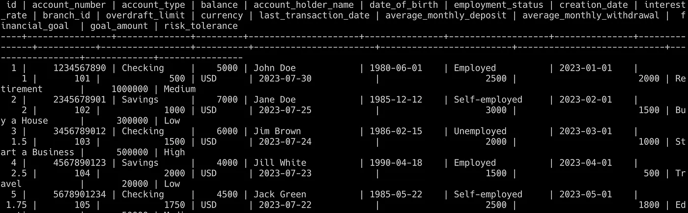

## Connection setup in prompt flow

### Custom connection to CosmosDB PostgreSQL database

In prompt flow, you can create a **custom connection** to connect to the CosmosDB PostgreSQL database. Creating a custom connection in prompt flow is based on specifying your authentication details as `key:value` pairs in a *YAML file*. For more information, refer to the [prompt flow connection guide](https://microsoft.github.io/promptflow/how-to-guides/manage-connections.html#create-a-connection).

In this tutorial, we provide a [conn.yaml](./source_file/custom_conn.yaml) template, which contains format keys for accessing the CosmosDB PostgreSQL database:

```yaml
$schema: https://azuremlschemas.azureedge.net/promptflow/latest/CustomConnection.schema.json
name: cosmos
type: custom
configs:
  endpoint: "<your-endpoint>"
  database: "citus"
  username: "citus"
  port: "<your-port>"
secrets:
  password: "<user-input>"
```

You can find the values for these keys in your CosmosDB instance's connection string:
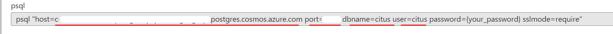

- endpoint: behind of the `host=` (e.g. `c-db-ozguler.XXXXX.postgres.cosmos.azure.com`).
- port: behind of the `port=`.
- database: behind of the `dbname=`.
- username: behind of the `user=`.
- password: behind of the `password=`.

To create the connection, execute the following command:

```shell
cd ./sample_gallery/database_querying/cosmosdb_postgresql/source_file
pf connection create -f ./conn.yaml --set configs.endpoint=<your-endpoint> configs.port=<your-port> secrets.password=<your-password>
```

### OpenAI/Azure OpenAI connection to LLM

To consume the OpenAI endpoint, you need to create the OpenAI connection in prompt flow, same as the Azure OpenAI connection.

Take the Azure OpenAI connection as an example. In this tutorial, we provide a [aoai_conn.yaml](./source_file/aoai_conn.yaml) template, which contains format keys for accessing the Azure OpenAI endpoint:

```yaml
$schema: https://azuremlschemas.azureedge.net/promptflow/latest/AzureOpenAIConnection.schema.json
name: azure_open_ai_connection
type: azure_open_ai # snake case
api_key: "to_replace_with_azure_openai_api_key"
api_base: "to_replace_with_azure_openai_api_endpoint"
api_type: "azure"
api_version: "2023-07-01-preview"
```

To create the connection, execute the following command:

```shell
cd ./sample_gallery/database_querying/cosmosdb_postgresql/source_file
pf connection create -f ./aoai_conn.yaml --set configs.api_key=<your-api=key> configs.api_base=<your-api-base>
```

Here the connection name is `azure_open_ai_connection`, you can customize it as you like by `--set configs.name=<your-connection-name>`.


## Local environment setup

### Prompt flow dependency

1. Install the prompt flow SDK

```bash
pip install promptflow promptflow-tools
```

More information about the SDK installation can be found [here](https://github.com/microsoft/promptflow/tree/main#installation).

2. Install the prompt flow extension in VS code

Search for `promptflow` in the VS code extension marketplace and install the extension.

More information about the extension can be found [here](https://marketplace.visualstudio.com/items?itemName=prompt-flow.prompt-flow).

### CosmosDB query dependency

For using the Cosmos SQL API, ensure that the `azure-cosmos` package is installed in your environment. This enables you to utilize the Cosmos DB custom connection in your Python code.

However since in this tutorial, we are using the **PostgreSQL Citus API**, so we will need to install the required **ODBC drivers** and other necessary packages to your local machine environment. For Linux, you can follow these steps:

1. Install system packages required for **pyodbc**

    ```shell
    apt-get update \
    && apt-get install -y --no-install-recommends \
    gcc \
    g++ \
    unixodbc-dev \
    && apt-get clean \
    && rm -rf /var/lib/apt/lists/*
    ```

1. Install **PostgreSQL ODBC Driver**
      
    ```shell
    apt-get update && apt-get install -y \
    curl \
    gnupg \
    && curl https://www.postgresql.org/media/keys/ACCC4CF8.asc | apt-key add - \
    && echo "deb http://apt.postgresql.org/pub/repos/apt/ buster-pgdg main" > /etc/apt/sources.list.d/pgdg.list \
    && apt-get update \
    && apt-get install -y odbc-postgresql \
    && apt-get clean \
    && rm -rf /var/lib/apt/lists/*
    ```

1. Install required packages defined in [requirements.txt](./source_file/image_build/requirements.txt)

    ```shell
    cd ./sample_gallery/database_querying/cosmosdb_postgresql/source_file/image_build
    pip install -r requirements.txt
    ```
> 💡 Tips:
> In this tutorial, we also provide a [**Docker file**](./source_file/image_build/Dockerfile) to simplify the setup process by docker.

## Connection setup in prompt flow

In prompt flow, you can create a **custom connection** to connect to the CosmosDB PostgreSQL database. Creating a custom connection in prompt flow is based on specifying your authentication details as `key:value` pairs in a *YAML file*. For more information, refer to the [prompt flow connection guide](https://microsoft.github.io/promptflow/how-to-guides/manage-connections.html#create-a-connection).

In this tutorial, we provide a [conn.yaml](./source_file/conn.yaml) template, which contains format keys for accessing the CosmosDB PostgreSQL database:

```yaml
$schema: https://azuremlschemas.azureedge.net/promptflow/latest/CustomConnection.schema.json
name: cosmos
type: custom
configs:
  endpoint: "<your-endpoint>"
  database: "citus"
  username: "citus"
  port: "<your-port>"
secrets:
  password: "<user-input>"
```

You can find the values for these keys in your CosmosDB instance's connection string:


- endpoint: behind of the `host=` (e.g. `c-db-ozguler.XXXXX.postgres.cosmos.azure.com`).
- port: behind of the `port=`.
- database: behind of the `dbname=`.
- username: behind of the `user=`.
- password: behind of the `password=`.

To create the connection, execute the following command:

```shell
cd ./sample_gallery/database_querying/cosmosdb_postgresql/source_file
pf connection create -f ./conn.yaml --set configs.endpoint=<your-endpoint> configs.port=<your-port> secrets.password=<your-password>
```

## Develop a flow to generate financial advise based on a PostgreSQL/CosmosDB query

In this tutorial, we've prepared a sample flow to generate financial advice. This flow is based on a specific customer's query and their data, which is pulled from the CosmosDB PostgreSQL. You can access the structure definition file of the flow in [flow.dag.yaml](./flow/flow.dag.yaml) located in the [personal_finance_recommender](./personal_finance_recommender/) folder.

By using the Prompt Flow VS Code extension, you can visually inspect this flow. The flow should look like this:

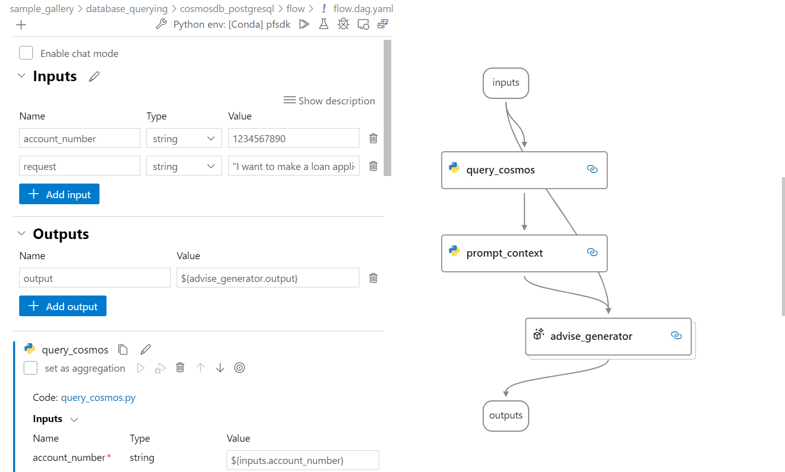

The flow has two input parameters:

* `account_number`: This identifies the customer in the database.
* `request`: This is the question asked by the customer.

The flow contains three nodes:

* `query_cosmos`: This Python node connects to the CosmosDB PostgreSQL database and queries the customer data using the account number.
    
    The `pyodbc` package is used to connect to the database and query the data. The connection string is initialized using the keys retrieved from the custom connection. For example:
    ```python
    import pyodbc  # Import the ODBC library
    from promptflow import tool
    from promptflow.connections import CustomConnection

    @tool
    def my_python_tool(account_number: str, connection: CustomConnection) -> str:

        host = connection.endpoint
        port = connection.port
        database = connection.database
        user = connection.username
        password = connection.password

        # Initialize the ODBC connection string
        # The driver below is for Linux. For Windows, use the following driver: DRIVER={SQL Server};
        conn_str = "DRIVER=/usr/lib/x86_64-linux-gnu/odbc/psqlodbcw.so;" + "SERVER=" + host + ";PORT=" + port + ";DATABASE=" + database + ";UID=" + user + ";PWD=" + password + ";sslmode=require;"
    
        # Initialize the ODBC connection
        conn = pyodbc.connect(conn_str)
    ```
* `prompt_content`: This Python node combines the queried customer data and the specific question for each field to create the prompt for the LLM to generate the financial advice.
* `advice_generator`: This LLM node generates the financial advice based on the prompt.

## Test the Flow

Once you've installed the `promptflow` package, you can perform a single test on the flow.

In the [sample flow](./personal_finance_recommender/), we are using the Azure OpenAI connection and the "gpt-4" model by default in the LLM node "advise_generator". You can change the model by modifying the `connection` parameter and `deployment_name` in the [flow.dag.yaml](./personal_finance_recommender/flow.dag.yaml) file.

```yaml
- name: advise_generator
  type: llm
  source:
    type: code
    path: advise_generator.jinja2
  inputs:
    deployment_name: gpt-4
    temperature: 0.8
    top_p: 1
    max_tokens: 5024
    presence_penalty: 0
    frequency_penalty: 0
    question: ${prompt_context.output}
    request: ${inputs.request}
    model: gpt-4
  connection: azure_open_ai_connection
  api: chat
```

by running the following command:

```shell
cd ./sample_gallery/database_querying
pf flow test --flow ./personal_finance_recommender --inputs account_number="1234567890" request="What is the best way to save money?"
```

Alternatively, you can also run the flow through the Visual Studio Code extension.

1. Open the [flow.dag.yaml](./sk_planner_flow/flow.dag.yaml) and switch to the visual editor.
1. Check the **Inputs** section, then click the **Run** button to run the flow.

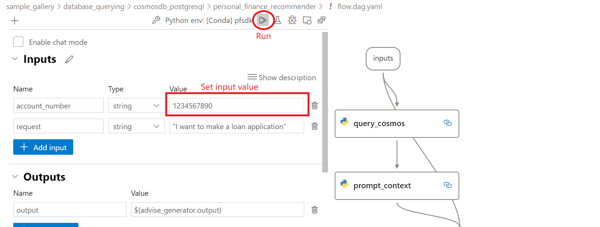

A sample generation result should look like this:

```shell
"output":"Subject: Comprehensive Financial Plan for John Doe's Loan Application Dear John Doe, Thank you for reaching out for assistance with your financial goals and loan application. Based on the detailed financial profile you provided, I have prepared a comprehensive financial plan that aligns with your long-term goals, 
risk tolerance, and current financial standing. Please find the plan outlined 
below. 1. Personalized Advice for Different Age Groups or Life Situations: 
- Considering your current goal of retirement, it is essential to start saving 
and investing early to take advantage of compounding returns. However, 
regardless of age, the principles of diversification and risk management remain
 crucial. I will factor in your age to determine an appropriate asset allocation
 strategy. 2. Account Type - Checking Account: - While a checking account
 provides liquidity and flexibility for day-to-day transactions, it may not 
align with your long-term financial objectives. I recommend opening additional 
accounts, such as a savings account or investment account, to allocate funds 
for specific purposes and potential growth. 3. Strategies for Maximizing the 
Value of Current Balance: - With a current balance of $5000, it is advisable 
to allocate a portion of this balance towards emergency funds as a safety net.
 I recommend setting aside 3-6 months' worth of living expenses in a high-yield
 savings account. This ensures you have access to funds in case of unexpected 
expenses or job loss. 4. Employment Status - Employed: - Your employment status
 provides a stable income source, allowing you to allocate a portion of your 
monthly earnings towards savings and investments. I will incorporate your 
mployment status into the financial plan to determine an appropriate savings 
rate and investment strategy. 5. Allocation of Average Monthly Deposit - $2500:
 - As a general guideline, I recommend allocating a certain percentage of your 
monthly deposit towards investments, savings, and emergency funds. Considering your medium risk tolerance, I suggest allocating 70% ($1750) towards investments, 20% ($500) towards savings, and 10% ($250) towards emergency funds. 6. Methods to Minimize Unnecessary Withdrawals: - To minimize unnecessary withdrawals, it is crucial to create a budget and stick to it. 
By tracking your expenses and prioritizing needs over wants, you can reduce the likelihood of making unnecessary withdrawals. 
Additionally, establishing an emergency fund will help cover unexpected expenses without tapping into your investment portfolio. 
7. Steps for Achieving Financial Goal - Retirement: - Short-term steps: - 
Review your current retirement savings and assess if they are on track to meet 
your desired retirement income. - Maximize contributions to tax-advantaged 
retirement accounts, such as a 401(k) or IRA, to take advantage of potential 
employer matches and tax benefits. - Consider working with a financial advisor 
to develop a retirement savings plan tailored to your specific goals and risk 
tolerance. - Long-term steps: - Regularly review and adjust your investment 
portfolio to ensure it aligns with your changing financial circumstances and 
risk tolerance. - Continuously increase your retirement savings contributions 
as your income allows. - Explore additional retirement savings vehicles, such 
as annuities or real estate investments, to diversify your retirement income sources. 8. Investment Opportunities based on Medium Risk Tolerance: - Given your medium risk tolerance, a balanced investment approach is recommended. This may include a combination of stocks, bonds, and other asset classes to achieve a diversified portfolio. - Investment options to explore include low-cost index funds, mutual funds, or exchange-traded funds (ETFs) that offer exposure to broad market indices. - Avoid high-risk investments, such as individual stocks or speculative ventures, that may not align with your risk tolerance. Please note that this plan serves as a general guideline and should be customized to your specific financial situation. It is advisable to consult with a financial advisor who can provide personalized recommendations tailored to your needs. I hope this comprehensive financial plan provides you with a solid foundation for achieving your financial goals and supports your loan application. Should you have any further questions or require additional assistance, please feel free to reach out. Best regards, [Your Name] [Your Title] [Contact Information]"
}
```

## Transfer the flow to Azure AI

For enterprises aiming to build a robust, high-quality Language Model (LLM) app, transferring the flow to Azure AI offers several benefits:

* Private data access and controls
* Collaborative development
* Automating iterative experimentation and CI/CD
* Deployment and optimization
* Safe and Responsible AI

More details about the benefits can be found in the [Prompt flow cloud documentation](https://microsoft.github.io/promptflow/cloud/index.html).

### Runtime and connection set up in Azure AI

**Create a custom environment**

You can create a new AzureML "custom environment" based on the existing default prompt flow runtime.

However, since we are using the PostgreSQL Citus API, we need to install the required ODBC drivers to the image. In this tutorial, we provide a [Dockerfile](./source_file/image_build/Dockerfile) and an [environment.yaml](./source_file/environment.yaml) file to create the custom environment using Azure CLI.

Run CLI command to create an environment:

```shell
cd ./sample_gallery/database_querying/cosmosdb_postgresql/source_file/image_build
az login(optional)
az ml environment create -f environment.yaml --subscription <sub-id> -g <resource-group> -w <workspace>
```

More details about how to create a custom environment you can refer to this [documentation](https://learn.microsoft.com/en-us/azure/machine-learning/prompt-flow/how-to-customize-environment-runtime?view=azureml-api-2)

**Create a runtime**

In AzureML prompt flow context, a container runtime  is referred to as an “Environment”. The compute that will run the new “Environment” is called a runtime. When your new “Environment” that includes cosmos-db is built correctly you will need to build a new “runtime” (the compute) that will run the new environment.

Create a new compute instance in your workspace, and create a new prompt flow runtime on top of this compute instance and the custom environment you created. This becomes your prompt flow runtime.

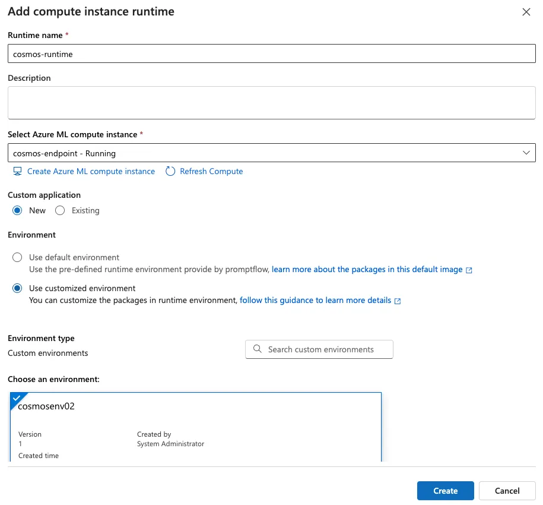

**Create a custom connection**

Create a new custom connection in AzureML prompt flow portal with the same key:value pairs as your local custom connection.

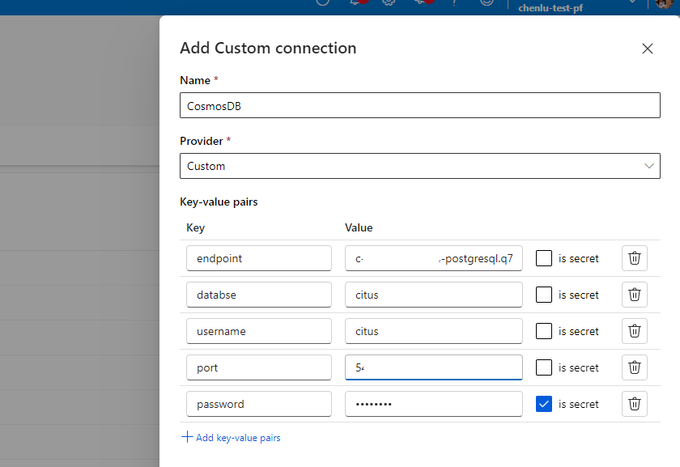

## Upload the flow to Azure AI and run it

After creating and testing the flow locally, you can easily upload the flow to Azure AI using the "import" operation in the portal. Consult the [import flow documentation](https://microsoft.github.io/promptflow/cloud/import.html) for more details.

In addition to the local SDK, we also provide a cloud SDK for you to manage the flow using Python code or command line. For example, you can use the following command to upload the flow to the Cloud Studio:

```shell
cd ./sample_gallery/database_querying/cosmosdb_postgresql       
pfazure flow create --flow ./personal_finance_recommender --subscription <your-subscription-id> --resource-group <your-resource-group> --workspace-name <your-workspace-name>
```

You can refer to the [pfazure documentation](https://microsoft.github.io/promptflow/reference/pfazure-command-reference.html#pfazure) for more details.

You can click on the portal link after "flow_portal_url" in the command reponse to go the flow page in Azure AI portal. The flow should look like this:
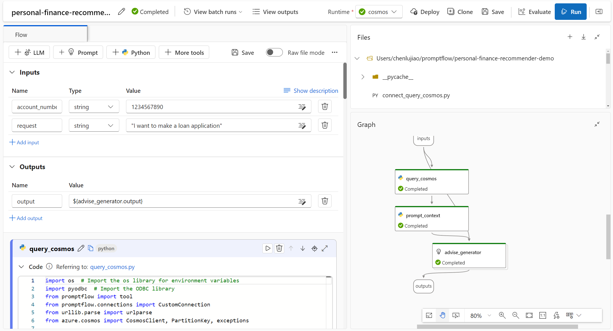

### Set runtime and connections in the flow

Select the runtime you have created in the previous step:
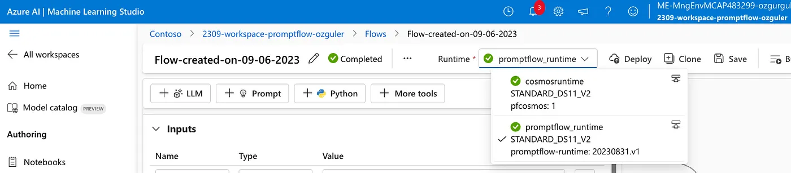

And select the custom connection you have created on the cosmos query node:
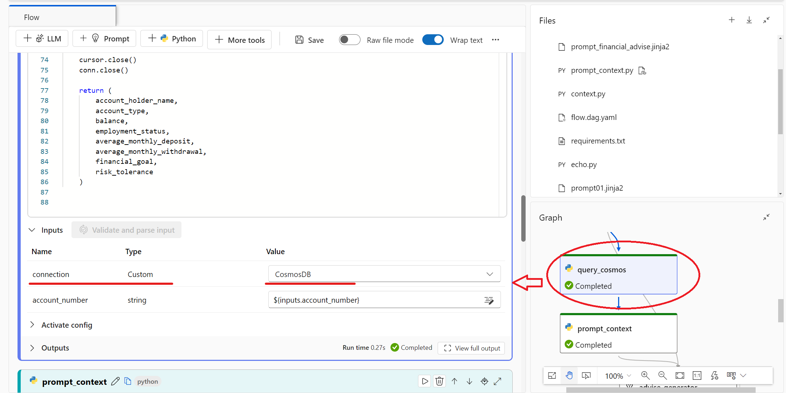

And aldo select the AzureOpenAI/OpenAI connection on the LLM node:
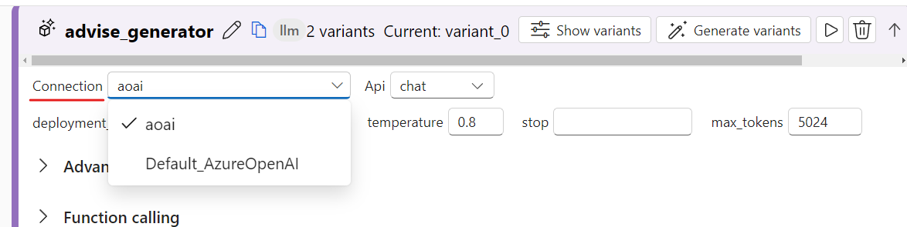

After that, you can run the flow by clicking the **Run** button.
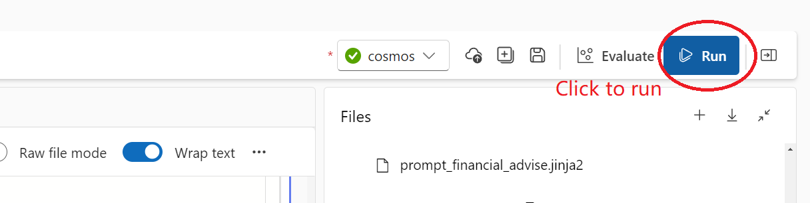

Once the flow run is completed, you can check the generation result by clicking on **View outputs** button.
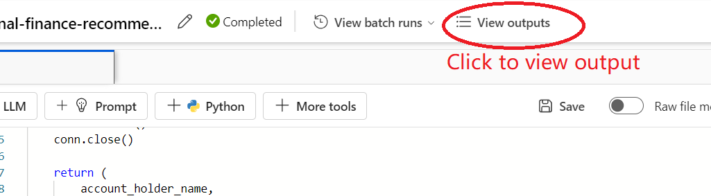
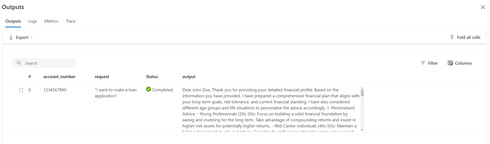

💡**Tips**:

More details on the setup you can refer to this [blog](https://cloudatlas.me/personalized-financial-advise-using-azureml-promptflow-azureopenai-banking-customer-data-on-86ad1176b097) that is introducing how to build the flow on Azure AI.
