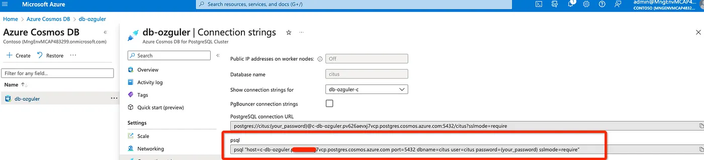

# Personalized Financial advise using banking customer data on PostgreSQL/CosmosDB

Customer data stored in operational databases will be useful to enrich context for LLM generations. In this post we will generate personalized financial advise to banking customers using their data stored in a database. We will use PromptFlow for LLM app development and postgresql / cosmosdb for storing customer data.

Prompt flow, a new service within Azure ML suite of services, tries to address challenges with LLM App development. Main benefit is that prompt flow brings together LLM’s, 3rd party API’s, OS models, tools for prompt engineering and to evaluate prompt/model variants.

* [Open-sourced prompt flow](https://github.com/microsoft/promptflow)
* [Prompt flow cloud - Azure Machine Learning](https://learn.microsoft.com/en-us/azure/machine-learning/prompt-flow/overview-what-is-prompt-flow?view=azureml-api-2)

In this tutorial we will use prompt flow open-sourced version, which is the pure local tool, to build a LLM-app that generates personalized financial advise to banking customers. We will use postgresql / cosmosdb for storing customer data -- *banking customers*, and query the database from prompt flow to enrich context for LLM generations.

## PostgreSQL/CosmosDB setup

[Azure Cosmos DB for PostgreSQL](https://learn.microsoft.com/en-us/azure/cosmos-db/postgresql/) is a managed service for PostgreSQL extended with the [Citus open source](https://github.com/citusdata/citus) superpower of distributed *tables*.

To create a PostgreSQL database on Azure, you can:
1. Go to Azure portal, select `Create` to create the Azure resource in your subscription. Then s
1. Select the `Azure Cosmos DB` resource type, select `PostgreSQL`.
1. Then you can follow the [Create an Azure Cosmos DB for PostgreSQL cluster in the Azure portal](https://learn.microsoft.com/en-us/azure/cosmos-db/postgresql/quickstart-create-portal?tabs=direct) tutorial to complete the resource configuration as your needs.


## Database setup

In our imaginary scenario we will integrate customer data stored in Cosmosdb / PostgreSQL with GPT models to generate financial advise for a customer intended task e.g. loan application, debt repayment.

After creating a cosmosdb instance on Azure we will create a customer banking db under postgresql / cosmosdb and upload banking data to it. GPT4 proves to be very useful in generating synthetic data, more on how to generate dataset using LLM you can refer to [Golden dataset](../../golden_dataset/copilot-golden-dataset-creation-guidance.md).

I simply used ChatGPT to create synthetic data for a banking customer database which will include data that can be used for financial advise such as “average_monthly_deposit”, “average_monthly_withdrawal”, “risk_tolerance”, “financial_goal” etc. I then copy ChatGPT generated synthetic data to a [data.csv](./source_file/data.csv) file and uploaded it to Cosmosdb/PostgreSQL database running on AzureI created earlier with a simple **df.to_sql** statement.

You can run code cells in the [cosmosdb_setup.ipynb](./source_file/cosmosdb_setup.ipynb) notebook to complete database setup:

1. Check the banking customer data file `data.csv`.
1. Connect to your PostgreSQL CosmosDB database.
1. Upload the data to the database.

By checking the data samples in the data file, you can see that the data is in the following format:

```shell
Index(['id', 'account_number', 'account_type', 'balance',
       'account_holder_name', 'date_of_birth', 'employment_status',
       'creation_date', 'interest_rate', 'branch_id', 'overdraft_limit',
       'currency', 'last_transaction_date', 'average_monthly_deposit',
       'average_monthly_withdrawal', 'financial_goal', 'goal_amount',
       'risk_tolerance'],
      dtype='object')

Sample data 
id,account_number,account_type,balance,account_holder_name,date_of_birth,employment_status,creation_date,interest_rate,branch_id,overdraft_limit,currency,last_transaction_date,average_monthly_deposit,average_monthly_withdrawal,financial_goal,goal_amount,risk_tolerance
1,1234567890,Checking,5000.00,John Doe,1980-06-01,Employed,2023-01-01,1.00,101,500.00,USD,2023-07-30,2500.00,2000.00,Retirement,1000000.00,Medium
2,2345678901,Savings,7000.00,Jane Doe,1985-12-12,Self-employed,2023-02-01,2.00,102,1000.00,USD,2023-07-25,3000.00,1500.00,Buy a House,300000.00,Low
```

After the dataset uploaded to the database, you can connect to your postgresql instance with `psql`, then run query to check the data. For example:

1. Copy the psql connection string to your terminal and connect to the db.
    

    ```shell
    psql -h c-db-ozguler.XXXXX.postgres.cosmos.azure.com -d citus -U citus -p 5432
    ```
1. Run query to check the data.

    ```shell
    citus=> SELECT * FROM bank_accounts;
    ```

    

## Connection setup in prompt flow

Create a PromptFlow custom connection to connect to cosmosdb PostgreSQL database.