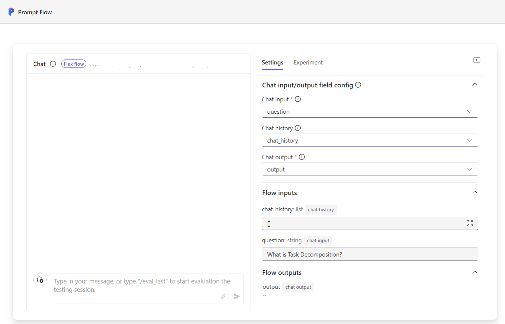

# Trace your application

## Prerequisite: setup environment

**Install the VS Code in your local**

Install the required packages from [requirements.txt](./requirements.txt) by running the following command:

```bash
pip install -r <Relative path>/requirements.txt

```

Setup your LLM key in `.env` file. Create a `.env` file in [rag](./rag/) directory of the project and add the following content:

```bash
AZURE_OPENAI_API_KEY=<your aoai key>
AZURE_OPENAI_ENDPOINT=<your aoai endpoint>
AZURE_OPENAI_EMBEDDING_DEPLOYMENT=<your aoai embedding model>
AZURE_OPENAI_API_VERSION=<your aoai api version>
AZURE_OPENAI_CHAT_DEPLOYMENT=<your aoai chat model>
```

## Test your application and view trace

To enable trace, you need to use the `promptflow.tracing` library, and add the decorator `@trace` to the function you want to trace.  More details can be found in the [entry file](./rag_flexflow.py).

Then you can run this script directly by running the following command:

```bash
python rag_flexflow.py
```

And after the script start running, you will see the following output in your terminal, which means the service has started successfully and you can view the traces in the browser by clicking the link provided in the output

```bash
Prompt flow service has started...
You can view the traces in local from http://localhost:...
```

## Chat with your application

Flex flow is a concept in prompt flow, the target user is engineers, the core idea is to build a flow with functions.

To chat with your application, you should covert your application into a flex flow, which is to build a [flow.flex.yaml](./flow.flex.yaml) file with entry file and entry function specified.

Then you can chat with your application by running the following command, which will create a yaml file for you automatically:

```bash
pf flow test --flow rag_flexflow:generate --ui
```

Then you will be able to access the chat interface in your browser.

1. Set **Chat input** to the input parameter for your function, for example the question.
2. Set **Chat history** to chat history parameter, for example the chat_hisroty.



Now you can chat with your application by sending the input to the chat interface.

## Trace your application in Azure AI Studio

Set trace destination to Azure AI project by running the following command:

```bash
az login
```

```bash
pf config set trace.destination="azureml://subscriptions/<subscription-id>/resourceGroups/<resource-group-name>/providers/Microsoft.MachineLearningServices/workspaces/<workspace-or-project-name>"
```

Then re-run your application, and you will be able to see another link in the output, which is the link to the trace in Azure AI Studio.

```bash
You can view the traces in cloud from Azure portal: https://ai.azure.com/projectflows/...
```
