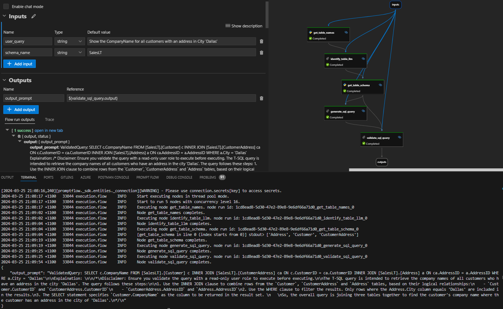

# Natural Language to SQL Converter

NL2SQL (Natural Language to SQL) is a process that allows users to input queries in natural, human language and have them translated into SQL queries. This is particularly useful for users who may not be familiar with SQL syntax but need to retrieve data from a database.

In this sample, we show how to use Azure OpenAI GPT-4 model and PromptFlow to facilitate this translation. The implementation is loosely based on the [LangChain SQL Database Agent](https://python.langchain.com/docs/use_cases/sql/quickstart)

#### Flow Overview:

 - Gather Inputs:
	 - user query (str): Natural language question from user
	 - schema name (str): Name of the schema to run the queries against. e.g - dbo, salesLT 
- (Python) Get Table Names:
	- Query the database for a list of all table names in the specified schema
- (LLM) Identify Table Names:
	- Use GPT-4 to list the required tables to query based on the user query. This is to ensure only the schema of relevant tables is passed in context to generate the SQL Query
- (Python) Get Table Schemas:
	- Query the database to get the structure and a few samples rows of the identified tables
	- We use the [SQLDatabase](https://python.langchain.com/docs/integrations/tools/sql_database) class from Langchain to gather the table info
- (LLM) Generate SQL Query:
	- Pass the tables info with row sampling as context and the user question to GPT-4 to generate a SQL Query
	- Prompt used - [Generate SQL Prompt](./generate_sql_query.jinja2)
- (LLM) Validate Generated SQL Query:
	- Validate the SQL query for completeness and generate a detailed explaination of the SQL query
	- Prompt used - [Validate SQL Prompt](./validate_sql_query.jinja2)
  
  *Note:* Prompts in this sample are specific to generate T-SQL complaint queries for [AdventureWorksLT](https://learn.microsoft.com/en-us/sql/samples/adventureworks-install-configure?view=sql-server-ver16&tabs=ssms) sample database hosted on Azure. However, you can modify the prompts as needed to work with other database systems.
  
## Getting Started

These instructions will get you a copy of the sample up and running using PromptFlow for development and testing purposes.

### Prerequisites

 1. The libraries required to run this project are listed in the `requirements.txt` file. To install them, use the following command: 

```bash
    pip  install  -r  requirements.txt
```

2. Deploy an Azure SQL Database with sample (AdventureWorksLT) - [Setup Guide)([Create a single database - Azure SQL Database | Microsoft Learn](https://learn.microsoft.com/en-us/azure/azure-sql/database/single-database-create-quickstart?view=azuresql&tabs=azure-portal)
3. Install and setup the [ODBC Driver for Microsoft SQL Server (17)](https://learn.microsoft.com/en-us/sql/connect/odbc/download-odbc-driver-for-sql-server?view=sql-server-ver16#version-17) to connect to the Azure SQL Database using pyodbc
	- (Local PromptFlow): Install the driver on the development machine
	- (Azure AI Studio): The Automatic Runtime doesn't contain the ODBC Driver, so you need to create a custom runtime with promptflow, pyodbc, and the driver installed. [Customize Runtime](https://learn.microsoft.com/en-us/azure/ai-studio/how-to/create-manage-runtime)
4. (Optional but highly recommended) Install and configure [Prompt flow for VS Code extension](https://marketplace.visualstudio.com/items?itemName=prompt-flow.prompt-flow) follow [Quick Start Guide](https://microsoft.github.io/promptflow/how-to-guides/quick-start.html).

    💡 This extension is optional but highly recommended for flow development and debugging.

### Connections Setup

We need to setup 2 connections to run this sample. [Manage PromptFlow Connections](https://microsoft.github.io/promptflow/how-to-guides/manage-connections.html)

 1. Azure OpenAI connection: Create a connection to you Azure OpenAI endpoint with a GPT-4 Model deployment. 
 2. Custom Connection: Create a custom connection for the Azure SQL Database. Sample YAML

```YML
$schema: https://azuremlschemas.azureedge.net/promptflow/latest/CustomConnection.schema.json
name: "to_replace_with_connection_name"
type: custom
configs:
  Server_name: "tcp:<server-name>.database.windows.net,1433"
  User_name: "<sql-login-name>"
  Database_name: "AdventureWorksLT"
secrets:
# Don't replace the '<user-input>' placeholder. The application will prompt you to enter a value when it runs.
  Password: "<user-input>"
```

Once the connections are created, modify the python and LLM nodes in the flow.dag.yaml with the appropriate connections names.

###### get_table_names (python tool)

```YAML
- name: get_table_names
    type: python
    source:
    type: code
    path: get_table_names.py
    inputs:
    sqlconn: <sql-connection-name>
    schema_name: ${inputs.schema_name}
```

###### identify_table_llm (LLM tool)

```YAML
- name: identify_table_llm
  type: llm
  source:
    type: code
    path: identify_table_llm.jinja2
  inputs:
    deployment_name: gpt-4
    response_format:
    type: text
    user_query: ${inputs.user_query}
    table_names: ${get_table_names.output}
  connection: azure_openai_connection
  api: chat
```

#### Sample Flow Run (VSCode)



### Important Notes

- This sample is not intended for production.
- Given approach only works when the Table and Column names in the Database are descriptive enough and can be mapped through the natural language query.
- Be descriptive in the ask. Explicitly call out the column names and relationships where possible to be able to generate accurate queries.
